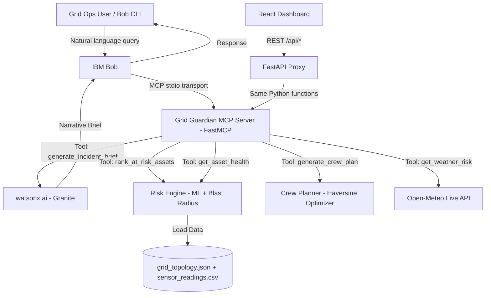

# Architecture

## System Architecture

The Grid Guardian architecture is designed to cleanly separate the complex analytical backend (Risk Engine) from the conversational AI integration (IBM Bob via FastMCP) and the visual presentation (React Dashboard).



## Components

| Component | Technology | Responsibility |
|---|---|---|
| Frontend | React (Vite) | Renders the SVG Grid Map, ranked asset tables, and the Chat panel. |
| API Proxy | FastAPI | Proxies HTTP requests from the frontend into the local Python environment. |
| Risk Engine | Python (scikit-learn) | Predicts failure probabilities using Gradient Boosting and computes Blast Radius graphs. |
| MCP Server | FastMCP | Exposes Risk Engine capabilities as Model Context Protocol tools. |
| LLM Layer | watsonx.ai (Granite) | Synthesizes complex ranked JSON data into plain English operational briefs. |
| Data Tier | Local JSON/CSV | Simulated historical and live telemetry data generated for the hackathon. |

## Data Flow

1. The frontend Dashboard requests risk data via REST to the FastAPI proxy.
2. The proxy calls the Python tool functions (e.g., `rank_at_risk_assets`).
3. The Risk Engine loads `grid_topology.json` and `sensor_readings.csv`, runs the sklearn prediction model, calculates the graph blast radius, and returns a combined score.
4. When the user queries the Chat Panel, the proxy invokes `generate_incident_brief`, which pulls the top-ranked assets, runs the geospatial crew planner, and pipes that structured JSON prompt to the watsonx.ai Granite model.
5. The Granite model returns a natural-language brief, which flows back up to the React Chat UI.

## IBM Bob Integration (Primary Interface)

**Bob is the primary interface for Grid Guardian.** The MCP server is registered
in `.bob/mcp.json` and Bob invokes all 5 tools natively via the MCP stdio
transport. Every capability in the system — risk ranking, asset health, weather
fusion, crew planning, and watsonx narrative generation — is accessible through
natural language queries to Bob.

The React dashboard is a **secondary visual layer** that calls the same
underlying Python tool functions via a FastAPI proxy, so both interfaces always
produce identical results from the same risk engine.

**Bob is the only path to `generate_incident_brief`** — the tool that chains
the entire pipeline end-to-end and calls watsonx.ai. Without the MCP server,
this chain cannot be invoked.

See [`docs/bob-demo.md`](bob-demo.md) for a full live session transcript with
real output from all 5 MCP tools.

## Security Considerations

- The `WATSONX_API_KEY` is strictly loaded via python-dotenv and is not exposed to the Vite frontend.
- The FastAPI backend uses CORS restricted specifically to the local Vite dev server port.

## Scalability Notes

For production, the file-based CSV storage would be replaced by a time-series database (like InfluxDB) and a graph database (like Neo4j) to compute the blast radius traversal across millions of nodes in real-time. The FastMCP layer would scale horizontally behind a load balancer.

---

## MCP Tool Contracts (Phase 3 Design Note)

This section defines the Model Context Protocol (MCP) tool contracts exposed by
`src/mcp_server/server.py`. Each tool wraps existing Phase 2 risk engine
functions as a thin MCP-callable layer. These contracts are the binding
agreement between the MCP server implementation (sub-task 3.2) and downstream
consumers (Bob/watsonx in Phase 4, frontend chat in Phase 5).

**Protocol:** MCP (Model Context Protocol) via the `mcp` Python SDK
(`FastMCP`). The server runs as a stdio-based MCP server.

**Conventions:**
- All tools return JSON-serializable dicts.
- All tools validate inputs and raise descriptive errors on invalid input
  (never crash silently, never return partial/wrong data).
- Return schemas match PROJECT_GUIDE Section 5 exactly.

---

### Tool 1: `get_asset_health`

**Purpose:** Retrieve the current health assessment for a single grid asset,
including its most recent sensor readings, failure probability, blast radius
impact score, and top contributing risk signals.

**Input Parameters:**

| Parameter  | Type   | Required | Description |
|------------|--------|----------|-------------|
| `asset_id` | string | yes      | The grid asset identifier (e.g., `"TX-001"`, `"FDR-003"`, `"SUB-002"`). Must exist in `grid_topology.json`. |

**Output Schema:**

```json
{
  "asset_id": "TX-001",
  "asset_name": "Transformer Alpha-1",
  "asset_type": "transformer",
  "latest_readings": {
    "timestamp": "2026-08-19T08:00:00",
    "temperature_c": 78.3,
    "vibration_mm_s": 5.12,
    "partial_discharge_pc": 42.7,
    "oil_quality_index": 58.1
  },
  "failure_probability_14d": 0.8234,
  "blast_radius_score": 45.0,
  "customers_at_risk": 3200,
  "critical_loads_at_risk": ["hospital"],
  "has_backup_path": false,
  "combined_priority_score": 59.9,
  "top_contributing_signals": ["rising_partial_discharge", "declining_oil_quality", "elevated_vibration", "no_backup_path"]
}
```

**Notes:**
- The `latest_readings` sub-object provides the raw sensor snapshot closest
  to `SIMULATION_CURRENT_DATE` (2026-08-20) for this asset. This gives the
  caller concrete numbers to cite when explaining why an asset is at risk.
- The probability, blast radius, and combined score fields come from
  `rank_assets()` output (Section 5.5).
- `asset_name` and `asset_type` come from `grid_topology.json` node metadata.

**Error cases:**
- Unknown `asset_id` → return error: `"Asset '{asset_id}' not found in grid topology."`

**Backend mapping:**
- Calls `risk_engine.rank_assets()` to get the full scored list, then filters
  to the requested `asset_id`.
- Reads `sensor_readings.csv` filtered to the target asset, sorted by
  timestamp descending, to extract the latest reading.
- Reads `grid_topology.json` for `asset_name` and `asset_type` metadata.

---

### Tool 2: `get_weather_risk`

**Purpose:** Fetch a real-time weather forecast for a location and flag
weather-related risk to grid assets in that area.

**Input Parameters:**

| Parameter | Type  | Required | Default | Description |
|-----------|-------|----------|---------|-------------|
| `lat`     | float | yes      | —       | Latitude of the location. |
| `lon`     | float | yes      | —       | Longitude of the location. |
| `days`    | int   | no       | 7       | Number of forecast days (1–16). |

**Output Schema:**

Matches Section 5.4 exactly, with an added top-level `overall_risk` summary:

```json
{
  "location": { "lat": 22.31, "lon": 73.18 },
  "forecast": [
    {
      "date": "2026-09-15",
      "temp_max_c": 38.2,
      "wind_speed_kph": 42.0,
      "precip_mm": 5.1,
      "storm_risk": "moderate"
    }
  ],
  "overall_risk": "moderate"
}
```

**`overall_risk` derivation:** The highest `storm_risk` value across all
forecast days. If any day is `"high"`, overall is `"high"`; else if any is
`"moderate"`, overall is `"moderate"`; else `"low"`.

**Error cases:**
- Network/API failure → return error with the `WeatherClientError` message
  (never silently return fake data).

**Backend mapping:**
- Calls `data.weather_client.get_forecast(lat, lon, days)` directly.
- Computes `overall_risk` from the returned forecast array.

**Schema addition note:** The `overall_risk` field is NOT in Section 5.4 of
the PROJECT_GUIDE. It is a convenience aggregation computed at the MCP tool
layer (not stored or invented in the data layer). It does not modify the
underlying `weather_client.py` return shape — it is appended by the tool
wrapper. If this is not acceptable, it can be removed with no impact on any
other component. **Flagging to user for approval.**

---

### Tool 3: `rank_at_risk_assets`

**Purpose:** Return the full ranked list of grid assets sorted by combined
priority score (failure probability weighted with blast-radius impact).

**Input Parameters:**

| Parameter | Type | Required | Default | Description |
|-----------|------|----------|---------|-------------|
| `top_n`   | int  | no       | 10      | Maximum number of assets to return. Pass `0` or omit for top 10. |

**Output Schema:**

Returns a list matching Section 5.5:

```json
{
  "ranked_assets": [
    {
      "asset_id": "TX-001",
      "failure_probability_14d": 0.8234,
      "blast_radius_score": 45.0,
      "customers_at_risk": 3200,
      "critical_loads_at_risk": ["hospital"],
      "has_backup_path": false,
      "combined_priority_score": 59.9,
      "top_contributing_signals": ["rising_partial_discharge", "declining_oil_quality", "elevated_vibration", "no_backup_path"]
    }
  ],
  "total_assets": 25,
  "as_of_date": "2026-08-20"
}
```

**Notes:**
- Each element in `ranked_assets` matches Section 5.5 schema exactly.
- `total_assets` is the total count of scored assets (before `top_n` filtering).
- `as_of_date` is `SIMULATION_CURRENT_DATE` for traceability.

**Error cases:**
- Invalid `top_n` (negative) → return error.
- If the risk engine fails internally (e.g., missing trained model file) →
  propagate the error with a descriptive message.

**Backend mapping:**
- Calls `risk_engine.rank_assets(top_n=top_n)` directly.
- Wraps the returned list in the `ranked_assets` envelope with metadata.

---

### Tool 4: `generate_crew_plan`

**Purpose:** Generate an optimized crew pre-positioning plan that assigns
maintenance crews to the highest-priority at-risk assets.

**Input Parameters:**

| Parameter        | Type         | Required | Default | Description |
|------------------|--------------|----------|---------|-------------|
| `crew_locations` | list[object] | no       | 4 default depots | List of crew starting positions. Each object: `{"crew_id": "CREW-A", "name": "Central Depot", "lat": 22.305, "lon": 73.19}`. |

**Output Schema:**

Matches Section 5.6 exactly:

```json
{
  "generated_at": "2026-09-14T10:00:00Z",
  "assignments": [
    {
      "crew_id": "CREW-A",
      "assigned_asset_id": "TX-001",
      "priority_rank": 1,
      "eta_minutes": 15,
      "reason": "Highest combined_priority_score; active failure signature detected; no backup path; serves hospital"
    }
  ],
  "unassigned_high_risk_assets": ["FDR-009"]
}
```

**Notes:**
- Uses greedy nearest-available-crew assignment algorithm.
- ETA is based on Haversine straight-line distance × 1.4 road factor ÷ 30 km/h.
- If `crew_locations` is omitted, uses the 4 default depots defined in
  `crew_planner.py` (Central, North Industrial, East University, Mobile Reserve).

**Error cases:**
- Invalid crew location object (missing required fields) → return error.
- Empty `crew_locations` list → return error (need at least one crew).

**Backend mapping:**
- Calls `risk_engine.crew_planner.generate_crew_plan(crew_locations=crew_locations)`.
- The function internally calls `rank_assets()` to get the current risk
  ranking, then assigns crews.

---

### MCP Server Implementation Notes

- **Framework:** `mcp` Python SDK (`FastMCP` class) — provides
  MCP-compliant tool registration and stdio transport out of the box.
- **Entry point:** `src/mcp_server/server.py` — creates a `FastMCP` server
  instance, registers the four tools above, and exposes them for MCP clients.
- **File layout:** One file per tool in `src/mcp_server/tools/`:
  - `get_asset_health.py`
  - `get_weather_risk.py`
  - `rank_at_risk_assets.py`
  - `generate_crew_plan.py`
- **Dependency:** The `mcp` package must be added to `src/requirements.txt`.
- **Running:** `python -m mcp_server` from the `src/` directory (or via
  `mcp run src/mcp_server/server.py` for MCP Inspector testing).
